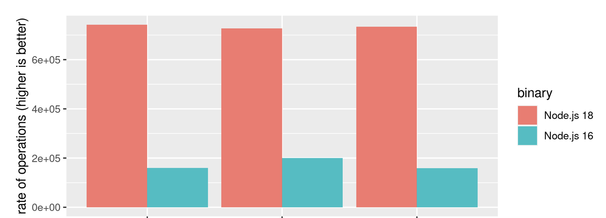
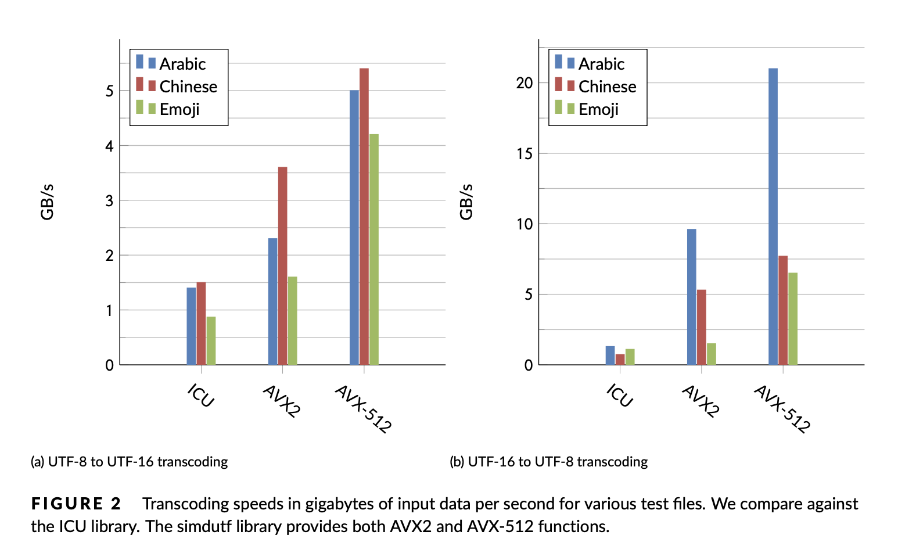

[](https://github.com/lemire/simdutf/actions/workflows/alpine.yml)
[](https://github.com/lemire/simdutf/actions/workflows/msys2.yml)
[](https://github.com/lemire/simdutf/actions/workflows/msys2-clang.yml)
[](https://github.com/lemire/simdutf/actions/workflows/ubuntu20sani.yml)
[](https://bugs.chromium.org/p/oss-fuzz/issues/list?sort=-opened&can=1&q=proj:simdutf)

# Table of contents

- [Table of contents](#table-of-contents)
- [simdutf: Unicode validation and transcoding at billions of characters per second](#simdutf-unicode-validation-and-transcoding-at-billions-of-characters-per-second)
  - [Real-World Usage](#real-world-usage)
  - [How fast is it?](#how-fast-is-it)
  - [Requirements](#requirements)
  - [Usage (Usage)](#usage-usage)
  - [Usage (CMake)](#usage-cmake)
  - [Single-header version](#single-header-version)
  - [Example](#example)
  - [API](#api)
  - [The sutf command-line tool](#the-sutf-command-line-tool)
  - [Manual implementation selection](#manual-implementation-selection)
  - [References](#references)
  - [License](#license)

simdutf: Unicode validation and transcoding at billions of characters per second
===============================================

Most modern software relies on the [Unicode standard](https://en.wikipedia.org/wiki/Unicode).
In memory, Unicode strings are represented using either
UTF-8 or UTF-16. The UTF-8 format is the de facto standard on the web (JSON, HTML, etc.) and it has been adopted as the default in many popular
programming languages (Go, Rust, Swift, etc.). The UTF-16 format is standard in Java, C# and in many Windows technologies.

Not all sequences of bytes are valid Unicode strings. It is unsafe to use Unicode strings in UTF-8 and UTF-16LE without first validating them. Furthermore, we often need to convert strings from one encoding to another, by a process called [transcoding](https://en.wikipedia.org/wiki/Transcoding). For security purposes, such transcoding should be validating: it should refuse to transcode incorrect strings.

This library provide fast Unicode functions such as

- ASCII, UTF-8, UTF-16LE/BE and UTF-32 validation, with and without error identification,
- Latin1 to UTF-8 transcoding,
- Latin1 to UTF-16LE/BE transcoding
- Latin1 to UTF-32 transcoding
- UTF-8 to Latin1 transcoding, with or without validation, with and without error identification,
- UTF-8 to UTF-16LE/BE transcoding, with or without validation, with and without error identification,
- UTF-8 to UTF-32 transcoding, with or without validation, with and without error identification,
- UTF-16LE/BE to Latin1 transcoding, with or without validation, with and without error identification,
- UTF-16LE/BE to UTF-8 transcoding, with or without validation, with and without error identification,
- UTF-32 to Latin1 transcoding, with or without validation, with and without error identification,
- UTF-32 to UTF-8 transcoding, with or without validation, with and without error identification,
- UTF-32 to UTF-16LE/BE transcoding, with or without validation, with and without error identification,
- UTF-16LE/BE to UTF-32 transcoding, with or without validation, with and without error identification,
- From an UTF-8 string, compute the size of the Latin1 equivalent string,
- From an UTF-8 string, compute the size of the UTF-16 equivalent string,
- From an UTF-8 string, compute the size of the UTF-32 equivalent string (equivalent to UTF-8 character counting),
- From an UTF-16LE/BE string, compute the size of the Latin1 equivalent string,
- From an UTF-16LE/BE string, compute the size of the UTF-8 equivalent string,
- From an UTF-32 string, compute the size of the UTF-8 or UTF-16LE equivalent string,
- From an UTF-16LE/BE string, compute the size of the UTF-32 equivalent string (equivalent to UTF-16 character counting),
- UTF-8 and UTF-16LE/BE character counting.
- UTF-16 endianness change (UTF16-LE/BE to UTF-16-BE/LE)

The functions are accelerated using SIMD instructions (e.g., ARM NEON, SSE, AVX, AVX-512, etc.). When your strings contain hundreds of characters, we can often transcode them at speeds exceeding a billion characters per second. You should expect high speeds not only with English strings (ASCII) but also Chinese, Japanese, Arabic, and so forth. We handle the full character range (including, for example, emojis).

The library compiles down to a small library of a few hundred kilobytes. Our functions are exception-free and non allocating. We have extensive tests and extensive benchmarks.


Real-World Usage
-----

The simdutf library is used by:
- [Node.js](https://nodejs.org/en/) (19.4.0 or better, 20.0 or better, 18.15 or better), a standard JavaScript runtime environment,
- [Bun](https://bun.sh), a fast JavaScript runtime environment,
- [graaljs](https://github.com/oracle/graaljs), a JavaScript implementation by Oracle,
- [Couchbase](https://www.couchbase.com), a popular database system,
- [haskell/text](https://github.com/haskell/text), a library for fast operations over Unicode text,
- [klogg](https://github.com/variar/klogg), a Really fast log explorer,
- [Pixie](https://github.com/pixie-io/pixie), observability tool for Kubernetes applications.


How fast is it?
-----------------

The adoption of the simdutf library by the popular Node.js JavaScript runtime lead to a significant
performance gain:

> Decoding and Encoding becomes considerably faster than in Node.js 18. With the addition of simdutf for UTF-8 parsing the observed benchmark, results improved by 364% (an extremely impressive leap) when decoding in comparison to Node.js 16. ([State of Node.js Performance 2023](https://blog.rafaelgss.dev/state-of-nodejs-performance-2023))





Over a wide range of realistic data sources, the simdutf library transcodes a billion characters per second or more. Our approach can be 3 to 10 times faster than the popular ICU library on difficult (non-ASCII) strings. We can be 20x faster than ICU when processing easy strings (ASCII). Our good results apply to both recent x64 and ARM processors.


To illustrate, we present a benchmark result with values are in billions of characters processed by second. Consider the following figures.


If your system supports AVX-512, the simdutf library can provide very high performance. We get the following speed results on an Ice Lake Intel processor (both AVX2 and AVX-512) are simdutf kernels:




Datasets: https://github.com/lemire/unicode_lipsum

Please refer to our benchmarking tool for a proper interpretation of the numbers. Our results are reproducible.


Requirements
-------

- C++11 compatible compiler. We support LLVM clang, GCC, Visual Studio. (Our optional benchmark tool requires C++17.)
- For high speed, you should have a recent 64-bit system (e.g., ARM or x64).
- If you rely on CMake, you should use a recent CMake (at least 3.15) ; otherwise you may use the [single header version](#single-header-version). The library is also available from Microsoft's vcpkg.
- AVX-512 support require a processor with AVX512-VBMI2 (Ice Lake or better) and a recent compiler (GCC 8 or better, Visual Studio 2022 or better, LLVM clang 6 or better). You need a correspondingly recent assembler such as gas (2.30+) or nasm (2.14+): recent compilers usually come with recent assemblers. If you mix a recent compiler with an incompatible/old assembler (e.g., when using a recent compiler with an old Linux distribution), you may get errors at build time because the compiler produces instructions that the assembler does not recognize: you should update your assembler to match your compiler (e.g., upgrade binutils to version 2.30 or better under Linux) or use an older compiler matching the capabilities of your assembler.

Usage (Usage)
-------


We made a video to help you get started with the library.

[](https://www.youtube.com/watch?v=H9NZtb7ykYs)<br />


Quick Start
-----------

Linux or macOS users might follow the following instructions if they have a recent C++ compiler installed and the standard utilities (`wget`, `unzip`, etc.)


1. Pull the library in a directory
   ```
   wget https://github.com/simdutf/simdutf/releases/download/v4.0.9/singleheader.zip
   unzip singleheader.zip
   ```
2. Compile
   ```
   c++ -std=c++17 -o amalgamation_demo amalgamation_demo.cpp
   ```
3. `./amalgamation_demo`

   ```
   valid UTF-8
   wrote 4 UTF-16LE words.
   valid UTF-16LE
   wrote 4 UTF-8 words.
   1234
   perfect round trip
   ```

Usage (CMake)
-------

```
cmake -B build
cmake --build build
cd build
ctest .
```

Visual Studio users must specify whether they want to build the Release or Debug version.

To run benchmarks, execute the `benchmark` command. You can get help on its
usage by first building it and then calling it with the `--help` flag.
E.g., under Linux you may do the following:

```
cmake -B build
cmake --build build
./build/benchmarks/benchmark --help
```

Instructions are similar for Visual Studio users.

To use the library as a CMake dependency in your project, please see `tests/installation_tests/from_fetch` for
an example.

Since ICU is so common and popular, we assume that you may have it already on your system. When
it is not found, it is simply omitted from the benchmarks. Thus, to benchmark against ICU, make
sure you have ICU installed on your machine and that cmake can find it. For macOS, you may
install it with brew using `brew install icu4c`. If you have ICU on your system but cmake cannot
find it, you may need to provide cmake with a path to ICU, such as `ICU_ROOT=/usr/local/opt/icu4c cmake -B build`.

Single-header version
----------------------

You can create a single-header version of the library where
all of the code is put into two files (`simdutf.h` and `simdutf.cpp`).
We publish a zip archive containing these files, e.g., see
https://github.com/simdutf/simdutf/releases/download/v4.0.9/singleheader.zip

You may generate it on your own using a Python script.

```
python3 ./singleheader/amalgamate.py
```

We require Python 3 or better.

Under Linux and macOS, you may test it as follows:

```
cd singleheader
c++ -o amalgamation_demo amalgamation_demo.cpp -std=c++17
./amalgamation_demo
```

Example
---------

Using the single-header version, you could compile the following program.

```cpp
#include <iostream>
#include <memory>

#include "simdutf.cpp"
#include "simdutf.h"

int main(int argc, char *argv[]) {
  const char *source = "1234";
  // 4 == strlen(source)
  bool validutf8 = simdutf::validate_utf8(source, 4);
  if (validutf8) {
    std::cout << "valid UTF-8" << std::endl;
  } else {
    std::cerr << "invalid UTF-8" << std::endl;
    return EXIT_FAILURE;
  }
  // We need a buffer of size where to write the UTF-16LE code units.
  size_t expected_utf16words = simdutf::utf16_length_from_utf8(source, 4);
  std::unique_ptr<char16_t[]> utf16_output{new char16_t[expected_utf16words]};
  // convert to UTF-16LE
  size_t utf16words =
      simdutf::convert_utf8_to_utf16le(source, 4, utf16_output.get());
  std::cout << "wrote " << utf16words << " UTF-16LE code units." << std::endl;
  // It wrote utf16words * sizeof(char16_t) bytes.
  bool validutf16 = simdutf::validate_utf16le(utf16_output.get(), utf16words);
  if (validutf16) {
    std::cout << "valid UTF-16LE" << std::endl;
  } else {
    std::cerr << "invalid UTF-16LE" << std::endl;
    return EXIT_FAILURE;
  }
  // convert it back:
  // We need a buffer of size where to write the UTF-8 code units.
  size_t expected_utf8words =
      simdutf::utf8_length_from_utf16le(utf16_output.get(), utf16words);
  std::unique_ptr<char[]> utf8_output{new char[expected_utf8words]};
  // convert to UTF-8
  size_t utf8words = simdutf::convert_utf16le_to_utf8(
      utf16_output.get(), utf16words, utf8_output.get());
  std::cout << "wrote " << utf8words << " UTF-8 code units." << std::endl;
  std::string final_string(utf8_output.get(), utf8words);
  std::cout << final_string << std::endl;
  if (final_string != source) {
    std::cerr << "bad conversion" << std::endl;
    return EXIT_FAILURE;
  } else {
    std::cerr << "perfect round trip" << std::endl;
  }
  return EXIT_SUCCESS;
}
```

API
-----

Our API is made of a few non-allocating functions. They typically take a pointer and a length as a parameter,
and they sometimes take a pointer to an output buffer. Users are responsible for memory allocation.

We use three types of data pointer types:
- `char*` for UTF-8 or indeterminate Unicode formats,
- `char16_t*` for UTF-16 (both UTF-16LE and UTF-16BE),
- `char32_t*` for UTF-32. UTF-32 is primarily used for internal use, not data interchange. Thus, unless otherwise stated, `char32_t` refers to the native type and is typically UTF-32LE since virtually all systems are little-endian today.
In generic terms, we refer to `char`, `char16_t`,  and `char32_t` as *code units*. A *character* may use several *code units*: between 1 and 4 code units in UTF-8, and between
1 and 2 code units in UTF-16LE and UTF-16BE.

Our functions and declarations are all in the `simdutf` namespace. Thus you should prefix our functions
and types with `simdutf::` as required.


We have basic functions to detect the type of an input. They return an integer defined by
the following `enum`.

```cpp
enum encoding_type {
        UTF8 = 1,       // BOM 0xef 0xbb 0xbf
        UTF16_LE = 2,   // BOM 0xff 0xfe
        UTF16_BE = 4,   // BOM 0xfe 0xff
        UTF32_LE = 8,   // BOM 0xff 0xfe 0x00 0x00
        UTF32_BE = 16,   // BOM 0x00 0x00 0xfe 0xff

        unspecified = 0
};
```

```cpp

/**
 * Autodetect the encoding of the input, a single encoding is recommended.
 * E.g., the function might return simdutf::encoding_type::UTF8,
 * simdutf::encoding_type::UTF16_LE, simdutf::encoding_type::UTF16_BE, or
 * simdutf::encoding_type::UTF32_LE.
 *
 * @param input the string to analyze.
 * @param length the length of the string in bytes.
 * @return the detected encoding type
 */
simdutf_warn_unused simdutf::encoding_type autodetect_encoding(const char * input, size_t length) noexcept;

/**
 * Autodetect the possible encodings of the input in one pass.
 * E.g., if the input might be UTF-16LE or UTF-8, this function returns
 * the value (simdutf::encoding_type::UTF8 | simdutf::encoding_type::UTF16_LE).
 *
 * Overridden by each implementation.
 *
 * @param input the string to analyze.
 * @param length the length of the string in bytes.
 * @return the detected encoding type
 */
simdutf_warn_unused int detect_encodings(const char * input, size_t length) noexcept;
```


For validation and transcoding, we also provide functions that will stop on error and return a result struct which is a pair of two fields:
```cpp
struct result {
  error_code error; // see `struct error_code`.
  size_t count; // In case of error, indicates the position of the error in the input in code units.
  // In case of success, indicates the number of code units validated/written.
};
```
On error, the `error` field indicates the type of error encountered and the `count` field indicates the position of the error in the input in code units or the number of characters validated/written.
We report six types of errors related to Latin1, UTF-8, UTF-16 and UTF-32 encodings:
```cpp
enum error_code {
  SUCCESS = 0,
  HEADER_BITS,  // Any byte must have fewer than 5 header bits.
  TOO_SHORT,    // The leading byte must be followed by N-1 continuation bytes, where N is the UTF-8 character length
                // This is also the error when the input is truncated.
  TOO_LONG,     // We either have too many consecutive continuation bytes or the string starts with a continuation byte.
  OVERLONG,     // The decoded character must be above U+7F for two-byte characters, U+7FF for three-byte characters,
                // and U+FFFF for four-byte characters.
  TOO_LARGE,    // The decoded character must be less than or equal to U+10FFFF,less than or equal than U+7F for ASCII OR less than equal than U+FF for Latin1
  SURROGATE,    // The decoded character must not be in U+D800...DFFF (UTF-8 or UTF-32) OR
                // a high surrogate must be followed by a low surrogate and a low surrogate must be preceded by a high surrogate (UTF-16) OR
                // there must be no surrogate at all (Latin1)
  OTHER         // Not related to validation/transcoding.
};

```
On success, the `error` field is set to `SUCCESS` and the `position` field indicates either the number of code units validated for validation functions or the number of written
code units in the output format for transcoding functions. In ASCII, Latin1 and UTF-8, code units occupy 8 bits (they are bytes); in UTF-16LE and UTF-16BE, code units occupy 16 bits; in UTF-32, code units occupy 32 bits.

Generally speaking, functions that report errors always stop soon after an error is
encountered and might therefore be faster on inputs where an error occurs early in the input.
The functions that return a boolean indicating whether or not an error has been encountered
are meant to be used in an *optimistic setting*---when we expect that inputs will almost always
be correct.

You may use functions that report an error to indicate where the problem happens during, as follows:

```cpp
  std::string bad_ascii = "\x20\x20\x20\x20\x20\xff\x20\x20\x20";
  simdutf::result res = implementation.validate_ascii_with_errors(bad_ascii.data(), bad_ascii.size());
  if(res.error != simdutf::error_code::SUCCESS) {
    std::cerr << "error at index " << res.count << std::endl;
  }
```

Or as follows:

```cpp
  std::string bad_utf8 = "\xc3\xa9\xc3\xa9\x20\xff\xc3\xa9";
  simdutf::result res = implementation.validate_utf8_with_errors(bad_utf8.data(), bad_utf8.size());
  if(res.error != simdutf::error_code::SUCCESS) {
    std::cerr << "error at index " << res.count << std::endl;
  }
  res = implementation.validate_utf8_with_errors(bad_utf8.data(), res.count);
  // will be successful in this case
  if(res.error == simdutf::error_code::SUCCESS) {
    std::cerr << "we have " << res.count << "valid bytes" << std::endl;
  }
```


We have fast validation functions.

```cpp
/**
 * Validate the ASCII string.
 *
 * Overridden by each implementation.
 *
 * @param buf the ASCII string to validate.
 * @param len the length of the string in bytes.
 * @return true if and only if the string is valid ASCII.
 */
simdutf_warn_unused bool validate_ascii(const char *buf, size_t len) noexcept;

/**
 * Validate the ASCII string and stop on error.
 *
 * Overridden by each implementation.
 *
 * @param buf the ASCII string to validate.
 * @param len the length of the string in bytes.
 * @return a result pair struct (of type simdutf::error containing the two fields error and count) with an error code and either position of the error (in the input in code units) if any, or the number of code units validated if successful.
 */
simdutf_warn_unused result validate_ascii_with_errors(const char *buf, size_t len) noexcept;

/**
 * Validate the UTF-8 string. This function may be best when you expect
 * the input to be almost always valid. Otherwise, consider using
 * validate_utf8_with_errors.
 *
 * Overridden by each implementation.
 *
 * @param buf the UTF-8 string to validate.
 * @param len the length of the string in bytes.
 * @return true if and only if the string is valid UTF-8.
 */
simdutf_warn_unused bool validate_utf8(const char *buf, size_t len) noexcept;

/**
 * Validate the UTF-8 string and stop on error. It might be faster than
 * validate_utf8 when an error is expected to occur early.
 *
 * Overridden by each implementation.
 *
 * @param buf the UTF-8 string to validate.
 * @param len the length of the string in bytes.
 * @return a result pair struct (of type simdutf::error containing the two fields error and count) with an error code and either position of the error (in the input in code units) if any, or the number of code units validated if successful.
 */
simdutf_warn_unused result validate_utf8_with_errors(const char *buf, size_t len) noexcept;

/**
 * Using native endianness; Validate the UTF-16 string.
 * This function may be best when you expect the input to be almost always valid.
 * Otherwise, consider using validate_utf16_with_errors.
 *
 * Overridden by each implementation.
 *
 * This function is not BOM-aware.
 *
 * @param buf the UTF-16 string to validate.
 * @param len the length of the string in number of 2-byte code units (char16_t).
 * @return true if and only if the string is valid UTF-16.
 */
simdutf_warn_unused bool validate_utf16(const char16_t *buf, size_t len) noexcept;

/**
 * Validate the UTF-16LE string. This function may be best when you expect
 * the input to be almost always valid. Otherwise, consider using
 * validate_utf16le_with_errors.
 *
 * Overridden by each implementation.
 *
 * This function is not BOM-aware.
 *
 * @param buf the UTF-16LE string to validate.
 * @param len the length of the string in number of 2-byte code units (char16_t).
 * @return true if and only if the string is valid UTF-16LE.
 */
simdutf_warn_unused bool validate_utf16le(const char16_t *buf, size_t len) noexcept;

/**
 * Validate the UTF-16BE string. This function may be best when you expect
 * the input to be almost always valid. Otherwise, consider using
 * validate_utf16be_with_errors.
 *
 * Overridden by each implementation.
 *
 * This function is not BOM-aware.
 *
 * @param buf the UTF-16BE string to validate.
 * @param len the length of the string in number of 2-byte code units (char16_t).
 * @return true if and only if the string is valid UTF-16BE.
 */
simdutf_warn_unused bool validate_utf16be(const char16_t *buf, size_t len) noexcept;

/**
 * Using native endianness; Validate the UTF-16 string and stop on error.
 * It might be faster than validate_utf16 when an error is expected to occur early.
 *
 * Overridden by each implementation.
 *
 * This function is not BOM-aware.
 *
 * @param buf the UTF-16 string to validate.
 * @param len the length of the string in number of 2-byte code units (char16_t).
 * @return a result pair struct (of type simdutf::error containing the two fields error and count) with an error code and either position of the error (in the input in code units) if any, or the number of code units validated if successful.
 */
simdutf_warn_unused result validate_utf16_with_errors(const char16_t *buf, size_t len) noexcept;

/**
 * Validate the UTF-16LE string and stop on error. It might be faster than
 * validate_utf16le when an error is expected to occur early.
 *
 * Overridden by each implementation.
 *
 * This function is not BOM-aware.
 *
 * @param buf the UTF-16LE string to validate.
 * @param len the length of the string in number of 2-byte code units (char16_t).
 * @return a result pair struct (of type simdutf::error containing the two fields error and count) with an error code and either position of the error (in the input in code units) if any, or the number of code units validated if successful.
 */
simdutf_warn_unused result validate_utf16le_with_errors(const char16_t *buf, size_t len) noexcept;

/**
 * Validate the UTF-16BE string and stop on error. It might be faster than
 * validate_utf16be when an error is expected to occur early.
 *
 * Overridden by each implementation.
 *
 * This function is not BOM-aware.
 *
 * @param buf the UTF-16BE string to validate.
 * @param len the length of the string in number of 2-byte code units (char16_t).
 * @return a result pair struct (of type simdutf::error containing the two fields error and count) with an error code and either position of the error (in the input in code units) if any, or the number of code units validated if successful.
 */
simdutf_warn_unused result validate_utf16be_with_errors(const char16_t *buf, size_t len) noexcept;

/**
 * Validate the UTF-32 string.
 *
 * Overridden by each implementation.
 *
 * This function is not BOM-aware.
 *
 * @param buf the UTF-32 string to validate.
 * @param len the length of the string in number of 4-byte code units (char32_t).
 * @return true if and only if the string is valid UTF-32.
 */
simdutf_warn_unused bool validate_utf32(const char32_t *buf, size_t len) noexcept;

/**
 * Validate the UTF-32 string and stop on error.
 *
 * Overridden by each implementation.
 *
 * This function is not BOM-aware.
 *
 * @param buf the UTF-32 string to validate.
 * @param len the length of the string in number of 4-byte code units (char32_t).
 * @return a result pair struct (of type simdutf::error containing the two fields error and count) with an error code and either position of the error (in the input in code units) if any, or the number of code units validated if successful.
 */
simdutf_warn_unused result validate_utf32_with_errors(const char32_t *buf, size_t len) noexcept;

```

Given a valid UTF-8 or UTF-16 input, you may count the number Unicode characters using
fast functions. For UTF-32, there is no need for a function given that each character
requires a flat 4 bytes. Likewise for Latin1: one byte will always equal one character.

```cpp
/**
 * Count the number of code points (characters) in the string assuming that
 * it is valid.
 *
 * This function assumes that the input string is valid UTF-16 (native endianness).
 *
 * This function is not BOM-aware.
 *
 * @param input         the UTF-16 string to process
 * @param length        the length of the string in 2-byte code units (char16_t)
 * @return number of code points
 */
simdutf_warn_unused size_t count_utf16(const char16_t * input, size_t length) noexcept;

/**
 * Count the number of code points (characters) in the string assuming that
 * it is valid.
 *
 * This function assumes that the input string is valid UTF-16LE.
 *
 * This function is not BOM-aware.
 *
 * @param input         the UTF-16LE string to process
 * @param length        the length of the string in 2-byte code units (char16_t)
 * @return number of code points
 */
simdutf_warn_unused size_t count_utf16le(const char16_t * input, size_t length) noexcept;

/**
 * Count the number of code points (characters) in the string assuming that
 * it is valid.
 *
 * This function assumes that the input string is valid UTF-16BE.
 *
 * This function is not BOM-aware.
 *
 * @param input         the UTF-16BE string to process
 * @param length        the length of the string in 2-byte code units (char16_t)
 * @return number of code points
 */
simdutf_warn_unused size_t count_utf16be(const char16_t * input, size_t length) noexcept;

/**
 * Count the number of code points (characters) in the string assuming that
 * it is valid.
 *
 * This function assumes that the input string is valid UTF-8.
 *
 * @param input         the UTF-8 string to process
 * @param length        the length of the string in bytes
 * @return number of code points
 */
simdutf_warn_unused size_t count_utf8(const char * input, size_t length) noexcept;

```

Prior to transcoding an input, you need to allocate enough memory to receive the result.
We have fast function that scan the input and compute the size of the output. These functions
are fast and non-validating.


```cpp

/**
 * Return the number of bytes that this Latin1 string would require in UTF-8 format.
 *
 * @param input         the Latin1 string to convert
 * @param length        the length of the string bytes
 * @return the number of bytes required to encode the Latin1 string as UTF-8
 */
simdutf_warn_unused size_t utf8_length_from_latin1(const char * input, size_t length) noexcept;

/**
 * Compute the number of bytes that this UTF-8 string would require in Latin1 format.
 *
 * This function does not validate the input.
 *
 * This function is not BOM-aware.
 *
 * @param input         the UTF-8 string to convert
 * @param length        the length of the string in byte
 * @return the number of bytes required to encode the UTF-8 string as Latin1
 */
simdutf_warn_unused size_t latin1_length_from_utf8(const char * input, size_t length) noexcept;

/*
 * Compute the number of bytes that this UTF-16LE/BE string would require in Latin1 format.
 *
 * This function does not validate the input.
 *
 * This function is not BOM-aware.
 *
 * @param length        the length of the string in 2-byte code units (char16_t)
 * @return the number of bytes required to encode the UTF-16LE string as Latin1
 */
simdutf_warn_unused size_t latin1_length_from_utf16(size_t length) noexcept;

/**
 * Compute the number of bytes that this UTF-32 string would require in Latin1 format.
 *
 * This function does not validate the input.
 *
 * This function is not BOM-aware.
 *
 * @param length        the length of the string in 4-byte code units (char32_t)
 * @return the number of bytes required to encode the UTF-32 string as Latin1
 */
simdutf_warn_unused size_t latin1_length_from_utf32(size_t length) noexcept;

/**
 * Compute the number of 2-byte code units that this UTF-8 string would require in UTF-16 format.
 *
 * This function does not validate the input.
 *
 * @param input         the UTF-8 string to process
 * @param length        the length of the string in bytes
 * @return the number of char16_t code units required to encode the UTF-8 string as UTF-16
 */
simdutf_warn_unused size_t utf16_length_from_utf8(const char * input, size_t length) noexcept;


/**
 * Compute the number of 4-byte code units that this UTF-8 string would require in UTF-32 format.
 *
 * This function is equivalent to count_utf8
 *
 * This function does not validate the input.
 *
 * This function is not BOM-aware.
 *
 * @param input         the UTF-8 string to process
 * @param length        the length of the string in bytes
 * @return the number of char32_t code units required to encode the UTF-8 string as UTF-32
 */
simdutf_warn_unused size_t utf32_length_from_utf8(const char * input, size_t length) noexcept;

/**
 * Using native endianness; Compute the number of bytes that this UTF-16
 * string would require in UTF-8 format.
 *
 * This function does not validate the input.
 *
 * @param input         the UTF-16 string to convert
 * @param length        the length of the string in 2-byte code units (char16_t)
 * @return the number of bytes required to encode the UTF-16LE string as UTF-8
 */
simdutf_warn_unused size_t utf8_length_from_utf16(const char16_t * input, size_t length) noexcept;

/**
 * Compute the number of bytes that this UTF-16LE string would require in UTF-8 format.
 *
 * This function does not validate the input.
 *
 * @param input         the UTF-16LE string to convert
 * @param length        the length of the string in 2-byte code units (char16_t)
 * @return the number of bytes required to encode the UTF-16LE string as UTF-8
 */
simdutf_warn_unused size_t utf8_length_from_utf16le(const char16_t * input, size_t length) noexcept;

/**
 * Compute the number of bytes that this UTF-16BE string would require in UTF-8 format.
 *
 * This function does not validate the input.
 *
 * @param input         the UTF-16BE string to convert
 * @param length        the length of the string in 2-byte code units (char16_t)
 * @return the number of bytes required to encode the UTF-16BE string as UTF-8
 */
simdutf_warn_unused size_t utf8_length_from_utf16be(const char16_t * input, size_t length) noexcept;

/**
 * Compute the number of bytes that this UTF-32 string would require in UTF-8 format.
 *
 * This function does not validate the input.
 *
 * @param input         the UTF-32 string to convert
 * @param length        the length of the string in 4-byte code units (char32_t)
 * @return the number of bytes required to encode the UTF-32 string as UTF-8
 */
simdutf_warn_unused size_t utf8_length_from_utf32(const char32_t * input, size_t length) noexcept;

/**
 * Compute the number of two-byte code units that this UTF-32 string would require in UTF-16 format.
 *
 * This function does not validate the input.
 *
 * @param input         the UTF-32 string to convert
 * @param length        the length of the string in 4-byte code units (char32_t)
 * @return the number of bytes required to encode the UTF-32 string as UTF-16
 */
simdutf_warn_unused size_t utf16_length_from_utf32(const char32_t * input, size_t length) noexcept;

/**
 * Using native endianness; Compute the number of bytes that this UTF-16
 * string would require in UTF-32 format.
 *
 * This function is equivalent to count_utf16.
 *
 * This function does not validate the input.
 *
 * This function is not BOM-aware.
 *
 * @param input         the UTF-16 string to convert
 * @param length        the length of the string in 2-byte code units (char16_t)
 * @return the number of bytes required to encode the UTF-16LE string as UTF-32
 */
simdutf_warn_unused size_t utf32_length_from_utf16(const char16_t * input, size_t length) noexcept;

/**
 * Compute the number of bytes that this UTF-16LE string would require in UTF-32 format.
 *
 * This function is equivalent to count_utf16le.
 *
 * This function does not validate the input.
 *
 * This function is not BOM-aware.
 *
 * @param input         the UTF-16LE string to convert
 * @param length        the length of the string in 2-byte code units (char16_t)
 * @return the number of bytes required to encode the UTF-16LE string as UTF-32
 */
simdutf_warn_unused size_t utf32_length_from_utf16le(const char16_t * input, size_t length) noexcept;

/**
 * Compute the number of bytes that this UTF-16BE string would require in UTF-32 format.
 *
 * This function is equivalent to count_utf16be.
 *
 * This function does not validate the input.
 *
 * This function is not BOM-aware.
 *
 * @param input         the UTF-16BE string to convert
 * @param length        the length of the string in 2-byte code units (char16_t)
 * @return the number of bytes required to encode the UTF-16BE string as UTF-32
 */
simdutf_warn_unused size_t utf32_length_from_utf16be(const char16_t * input, size_t length) noexcept;
```


We have a wide range of conversion between Latin1, UTF-8, UTF-16 and UTF-32. They assume
that you are allocated sufficient memory for the input. The simplest conversin
function output a single integer representing the size of the input, with a value of zero
indicating an error (e.g., `convert_utf8_to_utf16le`). They are well suited in the
scenario where you expect the input to be valid most of the time.


```cpp
/**
 * Convert Latin1 string into UTF8 string.
 *
 * This function is suitable to work with inputs from untrusted sources.
 *
 * @param input         the Latin1 string to convert
 * @param length        the length of the string in bytes
 * @param latin1_output  the pointer to buffer that can hold conversion result
 * @return the number of written char; 0 if conversion is not possible
 */
simdutf_warn_unused size_t convert_latin1_to_utf8(const char * input, size_t length, char* utf8_output) noexcept;

/**
 * Using native endianness, convert a Latin1 string into a UTF-16 string.
 *
 * @param input         the UTF-8 string to convert
 * @param length        the length of the string in bytes
 * @param utf16_buffer  the pointer to buffer that can hold conversion result
 * @return the number of written char16_t.
 */
simdutf_warn_unused size_t convert_latin1_to_utf16(const char * input, size_t length, char16_t* utf16_output) noexcept;

/**
 * Convert possibly Latin1 string into UTF-16LE string.
 *
 * This function is suitable to work with inputs from untrusted sources.
 *
 * @param input         the Latin1  string to convert
 * @param length        the length of the string in bytes
 * @param utf16_buffer  the pointer to buffer that can hold conversion result
 * @return the number of written char16_t; 0 if conversion is not possible
 */
simdutf_warn_unused size_t convert_latin1_to_utf16le(const char * input, size_t length, char16_t* utf16_output) noexcept;

/**
 * Convert Latin1 string into UTF-16BE string.
 *
 * This function is suitable to work with inputs from untrusted sources.
 *
 * @param input         the Latin1 string to convert
 * @param length        the length of the string in bytes
 * @param utf16_buffer  the pointer to buffer that can hold conversion result
 * @return the number of written char16_t; 0 if conversion is not possible
 */
simdutf_warn_unused size_t convert_latin1_to_utf16be(const char * input, size_t length, char16_t* utf16_output) noexcept;

/**
 * Convert Latin1 string into UTF-32 string.
 *
 * This function is suitable to work with inputs from untrusted sources.
 *
 * @param input         the Latin1 string to convert
 * @param length        the length of the string in bytes
 * @param utf32_buffer  the pointer to buffer that can hold conversion result
 * @return the number of written char32_t; 0 if conversion is not possible
 */
simdutf_warn_unused size_t convert_latin1_to_utf32(const char * input, size_t length, char32_t* utf32_buffer) noexcept;

/**
 * Convert possibly broken UTF-8 string into latin1 string.
 *
 * During the conversion also validation of the input string is done.
 * This function is suitable to work with inputs from untrusted sources.
 *
 * @param input         the UTF-8 string to convert
 * @param length        the length of the string in bytes
 * @param latin1_output  the pointer to buffer that can hold conversion result
 * @return the number of written char; 0 if the input was not valid UTF-8 string
 */
simdutf_warn_unused size_t convert_utf8_to_latin1(const char * input, size_t length, char* latin1_output) noexcept;

/**
 * Using native endianness; Convert possibly broken UTF-8 string into a UTF-16 string.
 *
 * During the conversion also validation of the input string is done.
 * This function is suitable to work with inputs from untrusted sources.
 *
 * @param input         the UTF-8 string to convert
 * @param length        the length of the string in bytes
 * @param utf16_buffer  the pointer to buffer that can hold conversion result
 * @return the number of written char16_t; 0 if the input was not valid UTF-8 string
 */
simdutf_warn_unused size_t convert_utf8_to_utf16(const char * input, size_t length, char16_t* utf16_output) noexcept;

/**
 * Convert possibly broken UTF-8 string into UTF-16LE string.
 *
 * During the conversion also validation of the input string is done.
 * This function is suitable to work with inputs from untrusted sources.
 *
 * @param input         the UTF-8 string to convert
 * @param length        the length of the string in bytes
 * @param utf16_buffer  the pointer to buffer that can hold conversion result
 * @return the number of written char16_t; 0 if the input was not valid UTF-8 string
 */
simdutf_warn_unused size_t convert_utf8_to_utf16le(const char * input, size_t length, char16_t* utf16_output) noexcept;

/**
 * Convert possibly broken UTF-8 string into UTF-16BE string.
 *
 * During the conversion also validation of the input string is done.
 * This function is suitable to work with inputs from untrusted sources.
 *
 * @param input         the UTF-8 string to convert
 * @param length        the length of the string in bytes
 * @param utf16_buffer  the pointer to buffer that can hold conversion result
 * @return the number of written char16_t; 0 if the input was not valid UTF-8 string
 */
simdutf_warn_unused size_t convert_utf8_to_utf16be(const char * input, size_t length, char16_t* utf16_output) noexcept;

/**
 * Convert possibly broken UTF-8 string into UTF-32 string.
 *
 * During the conversion also validation of the input string is done.
 * This function is suitable to work with inputs from untrusted sources.
 *
 * @param input         the UTF-8 string to convert
 * @param length        the length of the string in bytes
 * @param utf32_buffer  the pointer to buffer that can hold conversion result
 * @return the number of written char32_t; 0 if the input was not valid UTF-8 string
 */
simdutf_warn_unused size_t convert_utf8_to_utf32(const char * input, size_t length, char32_t* utf32_output) noexcept;


/**
 * Using native endianness, convert possibly broken UTF-16 string into Latin1 string.
 *
 * During the conversion also validation of the input string is done.
 * This function is suitable to work with inputs from untrusted sources.
 *
 * This function is not BOM-aware.
 *
 * @param input         the UTF-16 string to convert
 * @param length        the length of the string in 2-byte code units (char16_t)
 * @param latin1_buffer   the pointer to buffer that can hold conversion result
 * @return number of written code units; 0 if input is not a valid UTF-16LE string
 */
simdutf_warn_unused size_t convert_utf16_to_latin1(const char16_t * input, size_t length, char* latin1_buffer) noexcept;

/**
 * Convert possibly broken UTF-16LE string into Latin1 string.
 *
 * During the conversion also validation of the input string is done.
 * This function is suitable to work with inputs from untrusted sources.
 *
 * This function is not BOM-aware.
 *
 * @param input         the UTF-16LE string to convert
 * @param length        the length of the string in 2-byte code units (char16_t)
 * @param latin1_buffer   the pointer to buffer that can hold conversion result
 * @return number of written code units; 0 if input is not a valid UTF-16LE string
 */
simdutf_warn_unused size_t convert_utf16le_to_latin1(const char16_t * input, size_t length, char* latin1_buffer) noexcept;

/**
 * Convert possibly broken UTF-16BE string into Latin1 string.
 *
 * During the conversion also validation of the input string is done.
 * This function is suitable to work with inputs from untrusted sources.
 *
 * This function is not BOM-aware.
 *
 * @param input         the UTF-16BE string to convert
 * @param length        the length of the string in 2-byte code units (char16_t)
 * @param latin1_buffer   the pointer to buffer that can hold conversion result
 * @return a result pair struct (of type simdutf::error containing the two fields error and count) with an error code and either position of the error (in the input in code units) if any, or the number of char written if successful.
 */
simdutf_warn_unused size_t convert_utf16be_to_latin1(const char16_t * input, size_t length, char* latin1_buffer) noexcept;

/**
 * Convert possibly broken UTF-16LE string into UTF-8 string.
 *
 * During the conversion also validation of the input string is done.
 * This function is suitable to work with inputs from untrusted sources.
 *
 * This function is not BOM-aware.
 *
 * @param input         the UTF-16LE string to convert
 * @param length        the length of the string in 2-byte code units (char16_t)
 * @param utf8_buffer   the pointer to buffer that can hold conversion result
 * @return number of written code units; 0 if input is not a valid UTF-16LE string
 */
simdutf_warn_unused size_t convert_utf16le_to_utf8(const char16_t * input, size_t length, char* utf8_buffer) noexcept;

/**
 * Convert possibly broken UTF-16BE string into UTF-8 string.
 *
 * During the conversion also validation of the input string is done.
 * This function is suitable to work with inputs from untrusted sources.
 *
 * This function is not BOM-aware.
 *
 * @param input         the UTF-16BE string to convert
 * @param length        the length of the string in 2-byte code units (char16_t)
 * @param utf8_buffer   the pointer to buffer that can hold conversion result
 * @return number of written code units; 0 if input is not a valid UTF-16LE string
 */
simdutf_warn_unused size_t convert_utf16be_to_utf8(const char16_t * input, size_t length, char* utf8_buffer) noexcept;


/**
 * Convert possibly broken UTF-32 string into Latin1 string.
 *
 * During the conversion also validation of the input string is done.
 * This function is suitable to work with inputs from untrusted sources.
 *
 * This function is not BOM-aware.
 *
 * @param input         the UTF-32 string to convert
 * @param length        the length of the string in 4-byte code units (char32_t)
 * @param latin1_buffer   the pointer to buffer that can hold conversion result
 * @return number of written code units; 0 if input is not a valid UTF-32 string
 */
simdutf_warn_unused size_t convert_utf32_to_latin1(const char32_t * input, size_t length, char* latin1_buffer) noexcept;

/**
 * Convert possibly broken UTF-32 string into UTF-8 string.
 *
 * During the conversion also validation of the input string is done.
 * This function is suitable to work with inputs from untrusted sources.
 *
 * This function is not BOM-aware.
 *
 * @param input         the UTF-32 string to convert
 * @param length        the length of the string in 4-byte code units (char32_t)
 * @param utf8_buffer   the pointer to buffer that can hold conversion result
 * @return number of written code units; 0 if input is not a valid UTF-32 string
 */
simdutf_warn_unused size_t convert_utf32_to_utf8(const char32_t * input, size_t length, char* utf8_buffer) noexcept;

/**
 * Using native endianness; Convert possibly broken UTF-32 string into a UTF-16 string.
 *
 * During the conversion also validation of the input string is done.
 * This function is suitable to work with inputs from untrusted sources.
 *
 * This function is not BOM-aware.
 *
 * @param input         the UTF-32 string to convert
 * @param length        the length of the string in 4-byte code units (char32_t)
 * @param utf16_buffer   the pointer to buffer that can hold conversion result
 * @return number of written code units; 0 if input is not a valid UTF-32 string
 */
simdutf_warn_unused size_t convert_utf32_to_utf16(const char32_t * input, size_t length, char16_t* utf16_buffer) noexcept;

/**
 * Convert possibly broken UTF-32 string into UTF-16LE string.
 *
 * During the conversion also validation of the input string is done.
 * This function is suitable to work with inputs from untrusted sources.
 *
 * This function is not BOM-aware.
 *
 * @param input         the UTF-32 string to convert
 * @param length        the length of the string in 4-byte code units (char32_t)
 * @param utf16_buffer   the pointer to buffer that can hold conversion result
 * @return number of written code units; 0 if input is not a valid UTF-32 string
 */
simdutf_warn_unused size_t convert_utf32_to_utf16le(const char32_t * input, size_t length, char16_t* utf16_buffer) noexcept;

/**
 * Convert possibly broken UTF-32 string into UTF-16BE string.
 *
 * During the conversion also validation of the input string is done.
 * This function is suitable to work with inputs from untrusted sources.
 *
 * This function is not BOM-aware.
 *
 * @param input         the UTF-32 string to convert
 * @param length        the length of the string in 4-byte code units (char32_t)
 * @param utf16_buffer   the pointer to buffer that can hold conversion result
 * @return number of written code units; 0 if input is not a valid UTF-32 string
 */
simdutf_warn_unused size_t convert_utf32_to_utf16be(const char32_t * input, size_t length, char16_t* utf16_buffer) noexcept;

/**
 * Using native endianness; Convert possibly broken UTF-16 string into UTF-32 string.
 *
 * During the conversion also validation of the input string is done.
 * This function is suitable to work with inputs from untrusted sources.
 *
 * This function is not BOM-aware.
 *
 * @param input         the UTF-16 string to convert
 * @param length        the length of the string in 2-byte code units (char16_t)
 * @param utf32_buffer   the pointer to buffer that can hold conversion result
 * @return number of written code units; 0 if input is not a valid UTF-16LE string
 */
simdutf_warn_unused size_t convert_utf16_to_utf32(const char16_t * input, size_t length, char32_t* utf32_buffer) noexcept;

/**
 * Convert possibly broken UTF-16LE string into UTF-32 string.
 *
 * During the conversion also validation of the input string is done.
 * This function is suitable to work with inputs from untrusted sources.
 *
 * This function is not BOM-aware.
 *
 * @param input         the UTF-16LE string to convert
 * @param length        the length of the string in 2-byte code units (char16_t)
 * @param utf32_buffer   the pointer to buffer that can hold conversion result
 * @return number of written code units; 0 if input is not a valid UTF-16LE string
 */
simdutf_warn_unused size_t convert_utf16le_to_utf32(const char16_t * input, size_t length, char32_t* utf32_buffer) noexcept;

/**
 * Convert possibly broken UTF-16BE string into UTF-32 string.
 *
 * During the conversion also validation of the input string is done.
 * This function is suitable to work with inputs from untrusted sources.
 *
 * This function is not BOM-aware.
 *
 * @param input         the UTF-16BE string to convert
 * @param length        the length of the string in 2-byte code units (char16_t)
 * @param utf32_buffer   the pointer to buffer that can hold conversion result
 * @return number of written code units; 0 if input is not a valid UTF-16LE string
 */
simdutf_warn_unused size_t convert_utf16be_to_utf32(const char16_t * input, size_t length, char32_t* utf32_buffer) noexcept;
```

In some cases, you need to transcode UTF-8 or UTF-16 inputs, but you may have a truncated
string, meaning that the last character might be incomplete. In such cases, we recommend
trimming the end of your input so you do not encounter an error.

```cpp

/**
 * Given a valid UTF-8 string having a possibly truncated last character,
 * this function checks the end of string. If the last character is truncated (or partial),
 * then it returns a shorter length (shorter by 1 to 3 bytes) so that the short UTF-8
 * strings only contain complete characters. If there is no truncated character,
 * the original length is returned.
 *
 * This function assumes that the input string is valid UTF-8, but possibly truncated.
 *
 * @param input         the UTF-8 string to process
 * @param length        the length of the string in bytes
 * @return the length of the string in bytes, possibly shorter by 1 to 3 bytes
 */
simdutf_warn_unused size_t trim_partial_utf8(const char *input, size_t length);

/**
 * Given a valid UTF-16BE string having a possibly truncated last character,
 * this function checks the end of string. If the last character is truncated (or partial),
 * then it returns a shorter length (shorter by 1 unit) so that the short UTF-16BE
 * strings only contain complete characters. If there is no truncated character,
 * the original length is returned.
 *
 * This function assumes that the input string is valid UTF-16BE, but possibly truncated.
 *
 * @param input         the UTF-16BE string to process
 * @param length        the length of the string in bytes
 * @return the length of the string in bytes, possibly shorter by 1 unit
 */
simdutf_warn_unused size_t trim_partial_utf16be(const char16_t* input, size_t length);

/**
 * Given a valid UTF-16LE string having a possibly truncated last character,
 * this function checks the end of string. If the last character is truncated (or partial),
 * then it returns a shorter length (shorter by 1 unit) so that the short UTF-16LE
 * strings only contain complete characters. If there is no truncated character,
 * the original length is returned.
 *
 * This function assumes that the input string is valid UTF-16LE, but possibly truncated.
 *
 * @param input         the UTF-16LE string to process
 * @param length        the length of the string in bytes
 * @return the length of the string in unit, possibly shorter by 1 unit
 */
simdutf_warn_unused size_t trim_partial_utf16le(const char16_t* input, size_t length);


/**
 * Given a valid UTF-16 string having a possibly truncated last character,
 * this function checks the end of string. If the last character is truncated (or partial),
 * then it returns a shorter length (shorter by 1 unit) so that the short UTF-16
 * strings only contain complete characters. If there is no truncated character,
 * the original length is returned.
 *
 * This function assumes that the input string is valid UTF-16, but possibly truncated.
 * We use the native endianness.
 *
 * @param input         the UTF-16 string to process
 * @param length        the length of the string in bytes
 * @return the length of the string in unit, possibly shorter by 1 unit
 */
simdutf_warn_unused size_t trim_partial_utf16(const char16_t* input, size_t length);
```

You may use these `trim_` functions to decode inputs piece by piece, as in the following
examples. First a case where you want to decode a UTF-8 strings in two steps:

```cpp
  const char unicode[] = "\xc3\xa9\x63ole d'\xc3\xa9t\xc3\xa9";
  // suppose you want to decode only the start of this string.
  size_t length = 10;
  // Picking 10 bytes is problematic because we might end up in the middle of a
  // code point. But we can rewind to the previous code point.
  length = simdutf::trim_partial_utf8(unicode, length);
  // Now we can transcode safely
  size_t budget_utf16 = simdutf::utf16_length_from_utf8(unicode, length);
  std::unique_ptr<char16_t[]> utf16{new char16_t[budget_utf16]};
  size_t utf16words =
      simdutf::convert_utf8_to_utf16le(unicode, length, utf16.get());
  // We can then transcode the next batch
  const char * next = unicode + length;
  size_t next_length = sizeof(unicode) - length;
  size_t next_budget_utf16 = simdutf::utf16_length_from_utf8(next, next_length);
  std::unique_ptr<char16_t[]> next_utf16{new char16_t[next_budget_utf16]};
  size_t next_utf16words =
      simdutf::convert_utf8_to_utf16le(next, next_length, next_utf16.get());
```

You can use the same approach with UTF-16:

```cpp  // We have three sequences of surrogate pairs (UTF-16).
  const char16_t unicode[] = u"\x3cd8\x10df\x3cd8\x10df\x3cd8\x10df";
  // suppose you want to decode only the start of this string.
  size_t length = 3;
  // Picking 3 units is problematic because we might end up in the middle of a
  // surrogate pair. But we can rewind to the previous code point.
  length = simdutf::trim_partial_utf16(unicode, length);
  // Now we can transcode safely
  size_t budget_utf8 = simdutf::utf8_length_from_utf16(unicode, length);
  std::unique_ptr<char[]> utf8{new char[budget_utf8]};
  size_t utf8words =
      simdutf::convert_utf16_to_utf8(unicode, length, utf8.get());
  // We can then transcode the next batch
  const char16_t * next = unicode + length;
  size_t next_length = 6 - length;
  size_t next_budget_utf8 = simdutf::utf8_length_from_utf16(next, next_length);
  std::unique_ptr<char[]> next_utf8{new char[next_budget_utf8]};
  size_t next_utf8words =
      simdutf::convert_utf16_to_utf8(next, next_length, next_utf8.get());
```


We have more advanced conversion functions which output a `simdutf::result` structure with
an indication of the error type and a `count` entry (e.g., `convert_utf8_to_utf16le_with_errors`).
They are well suited when you expect that there might be errors in the input that require
further investigation. The `count` field contains the location of the error in the input in code units,
if there is an error, or otherwise the number of code units written. You may use these functions as follows:

```cpp
  // this UTF-8 string has a bad byte at index 5
  std::string bad_utf8 = "\xc3\xa9\xc3\xa9\x20\xff\xc3\xa9";
  size_t budget_utf16 = simdutf::utf16_length_from_utf8(bad_utf8.data(), bad_utf8.size());
  std::unique_ptr<char16_t[]> utf16{new char16_t[budget_utf16]};
  simdutf::result res = simdutf::convert_utf8_to_utf16_with_errors(bad_utf8.data(), bad_utf8.size(), utf16.get());
  if(res.error != simdutf::error_code::SUCCESS) {
    std::cerr << "error at index " << res.count << std::endl;
  }
  // the following will be successful
  res = simdutf::convert_utf8_to_utf16_with_errors(bad_utf8.data(), res.count, utf16.get());
  if(res.error == simdutf::error_code::SUCCESS) {
    std::cerr << "we have transcoded " << res.count << " characters" << std::endl;
  }
```

We have several transcoding functions returning `simdutf::error` results:

```cpp
/**
 * Convert possibly broken UTF-8 string into latin1 string with errors
 *
 * During the conversion also validation of the input string is done.
 * This function is suitable to work with inputs from untrusted sources.
 *
 * @param input         the UTF-8 string to convert
 * @param length        the length of the string in bytes
 * @param latin1_output  the pointer to buffer that can hold conversion result
 * @return a result pair struct (of type simdutf::error containing the two fields error and count) with an error code and either position of the error (in the input in code units) if any, or the number of code units validated if successful.
 */
simdutf_warn_unused result convert_utf8_to_latin1_with_errors(const char * input, size_t length, char* latin1_output) noexcept;

/**
 * Convert possibly broken UTF-16LE string into Latin1 string.
 *
 * During the conversion also validation of the input string is done.
 * This function is suitable to work with inputs from untrusted sources.
 * This function is not BOM-aware.
 *
 * @param input         the UTF-16LE string to convert
 * @param length        the length of the string in 2-byte code units (char16_t)
 * @param latin1_buffer   the pointer to buffer that can hold conversion result
 * @return a result pair struct (of type simdutf::error containing the two fields error and count) with an error code and either position of the error (in the input in code units) if any, or the number of char written if successful.
 */
simdutf_warn_unused result convert_utf16le_to_latin1_with_errors(const char16_t * input, size_t length, char* latin1_buffer) noexcept;

/**
 * Convert possibly broken UTF-16BE string into Latin1 string.
 *
 * During the conversion also validation of the input string is done.
 * This function is suitable to work with inputs from untrusted sources.
 * This function is not BOM-aware.
 *
 * @param input         the UTF-16BE string to convert
 * @param length        the length of the string in 2-byte code units (char16_t)
 * @param latin1_buffer   the pointer to buffer that can hold conversion result
 * @return a result pair struct (of type simdutf::error containing the two fields error and count) with an error code and either position of the error (in the input in code units) if any, or the number of char written if successful.
 */
simdutf_warn_unused result convert_utf16be_to_latin1_with_errors(const char16_t * input, size_t length, char* latin1_buffer) noexcept;

/**
 * Using native endianness, convert possibly broken UTF-16 string into Latin1 string.
 *
 * During the conversion also validation of the input string is done.
 * This function is suitable to work with inputs from untrusted sources.
 * This function is not BOM-aware.
 *
 * @param input         the UTF-16 string to convert
 * @param length        the length of the string in 2-byte code units (char16_t)
 * @param latin1_buffer   the pointer to buffer that can hold conversion result
 * @return a result pair struct (of type simdutf::error containing the two fields error and count) with an error code and either position of the error (in the input in code units) if any, or the number of char written if successful.
 */
simdutf_warn_unused result convert_utf16_to_latin1_with_errors(const char16_t * input, size_t length, char* latin1_buffer) noexcept;


/**
 * Using native endianness; Convert possibly broken UTF-8 string into UTF-16
 * string and stop on error.
 *
 * During the conversion also validation of the input string is done.
 * This function is suitable to work with inputs from untrusted sources.
 *
 * @param input         the UTF-8 string to convert
 * @param length        the length of the string in bytes
 * @param utf16_buffer  the pointer to buffer that can hold conversion result
 * @return a result pair struct (of type simdutf::error containing the two fields error and count) with an error code and either position of the error (in the input in code units) if any, or the number of char16_t written if successful.
 */
simdutf_warn_unused result convert_utf8_to_utf16_with_errors(const char * input, size_t length, char16_t* utf16_output) noexcept;

/**
 * Convert possibly broken UTF-8 string into UTF-16LE string and stop on error.
 *
 * During the conversion also validation of the input string is done.
 * This function is suitable to work with inputs from untrusted sources.
 *
 * @param input         the UTF-8 string to convert
 * @param length        the length of the string in bytes
 * @param utf16_buffer  the pointer to buffer that can hold conversion result
 * @return a result pair struct (of type simdutf::error containing the two fields error and count) with an error code and either position of the error (in the input in code units) if any, or the number of char16_t written if successful.
 */
simdutf_warn_unused result convert_utf8_to_utf16le_with_errors(const char * input, size_t length, char16_t* utf16_output) noexcept;

/**
 * Convert possibly broken UTF-8 string into UTF-16BE string and stop on error.
 *
 * During the conversion also validation of the input string is done.
 * This function is suitable to work with inputs from untrusted sources.
 *
 * @param input         the UTF-8 string to convert
 * @param length        the length of the string in bytes
 * @param utf16_buffer  the pointer to buffer that can hold conversion result
 * @return a result pair struct (of type simdutf::error containing the two fields error and count) with an error code and either position of the error (in the input in code units) if any, or the number of char16_t written if successful.
 */
simdutf_warn_unused result convert_utf8_to_utf16be_with_errors(const char * input, size_t length, char16_t* utf16_output) noexcept;

/**
 * Convert possibly broken UTF-8 string into UTF-32 string and stop on error.
 *
 * During the conversion also validation of the input string is done.
 * This function is suitable to work with inputs from untrusted sources.
 *
 * @param input         the UTF-8 string to convert
 * @param length        the length of the string in bytes
 * @param utf32_buffer  the pointer to buffer that can hold conversion result
 * @return a result pair struct (of type simdutf::error containing the two fields error and count) with an error code and either position of the error (in the input in code units) if any, or the number of char32_t written if successful.
 */
simdutf_warn_unused result convert_utf8_to_utf32_with_errors(const char * input, size_t length, char32_t* utf32_output) noexcept;


/**
 * Convert possibly broken UTF-16LE string into UTF-8 string and stop on error.
 *
 * During the conversion also validation of the input string is done.
 * This function is suitable to work with inputs from untrusted sources.
 *
 * This function is not BOM-aware.
 *
 * @param input         the UTF-16LE string to convert
 * @param length        the length of the string in 2-byte code units (char16_t)
 * @param utf8_buffer   the pointer to buffer that can hold conversion result
 * @return a result pair struct (of type simdutf::error containing the two fields error and count) with an error code and either position of the error (in the input in code units) if any, or the number of char written if successful.
 */
simdutf_warn_unused result convert_utf16le_to_utf8_with_errors(const char16_t * input, size_t length, char* utf8_buffer) noexcept;

/**
 * Convert possibly broken UTF-16BE string into UTF-8 string and stop on error.
 *
 * During the conversion also validation of the input string is done.
 * This function is suitable to work with inputs from untrusted sources.
 *
 * This function is not BOM-aware.
 *
 * @param input         the UTF-16BE string to convert
 * @param length        the length of the string in 2-byte code units (char16_t)
 * @param utf8_buffer   the pointer to buffer that can hold conversion result
 * @return a result pair struct (of type simdutf::error containing the two fields error and count) with an error code and either position of the error (in the input in code units) if any, or the number of char written if successful.
 */
simdutf_warn_unused result convert_utf16be_to_utf8_with_errors(const char16_t * input, size_t length, char* utf8_buffer) noexcept;


/**
 * Convert possibly broken UTF-32 string into Latin1 string and stop on error.
 *
 * During the conversion also validation of the input string is done.
 * This function is suitable to work with inputs from untrusted sources.
 *
 * This function is not BOM-aware.
 *
 * @param input         the UTF-32 string to convert
 * @param length        the length of the string in 4-byte code units (char32_t)
 * @param latin1_buffer   the pointer to buffer that can hold conversion result
 * @return a result pair struct (of type simdutf::error containing the two fields error and count) with an error code and either position of the error (in the input in code units) if any, or the number of char written if successful.
 */
simdutf_warn_unused result convert_utf32_to_latin1_with_errors(const char32_t * input, size_t length, char* latin1_buffer) noexcept;


/**
 * Convert possibly broken UTF-32 string into UTF-8 string and stop on error.
 *
 * During the conversion also validation of the input string is done.
 * This function is suitable to work with inputs from untrusted sources.
 *
 * This function is not BOM-aware.
 *
 * @param input         the UTF-32 string to convert
 * @param length        the length of the string in 4-byte code units (char32_t)
 * @param utf8_buffer   the pointer to buffer that can hold conversion result
 * @return a result pair struct (of type simdutf::error containing the two fields error and count) with an error code and either position of the error (in the input in code units) if any, or the number of char written if successful.
 */
simdutf_warn_unused result convert_utf32_to_utf8_with_errors(const char32_t * input, size_t length, char* utf8_buffer) noexcept;

/**
 * Using native endianness; Convert possibly broken UTF-32 string into UTF-16
 * string and stop on error.
 *
 * During the conversion also validation of the input string is done.
 * This function is suitable to work with inputs from untrusted sources.
 *
 * This function is not BOM-aware.
 *
 * @param input         the UTF-32 string to convert
 * @param length        the length of the string in 4-byte code units (char32_t)
 * @param utf16_buffer   the pointer to buffer that can hold conversion result
 * @return a result pair struct (of type simdutf::error containing the two fields error and count) with an error code and either position of the error (in the input in code units) if any, or the number of char16_t written if successful.
 */
simdutf_warn_unused result convert_utf32_to_utf16_with_errors(const char32_t * input, size_t length, char16_t* utf16_buffer) noexcept;

/**
 * Convert possibly broken UTF-32 string into UTF-16LE string and stop on error.
 *
 * During the conversion also validation of the input string is done.
 * This function is suitable to work with inputs from untrusted sources.
 *
 * This function is not BOM-aware.
 *
 * @param input         the UTF-32 string to convert
 * @param length        the length of the string in 4-byte code units (char32_t)
 * @param utf16_buffer   the pointer to buffer that can hold conversion result
 * @return a result pair struct (of type simdutf::error containing the two fields error and count) with an error code and either position of the error (in the input in code units) if any, or the number of char16_t written if successful.
 */
simdutf_warn_unused result convert_utf32_to_utf16le_with_errors(const char32_t * input, size_t length, char16_t* utf16_buffer) noexcept;

/**
 * Convert possibly broken UTF-32 string into UTF-16BE string and stop on error.
 *
 * During the conversion also validation of the input string is done.
 * This function is suitable to work with inputs from untrusted sources.
 *
 * This function is not BOM-aware.
 *
 * @param input         the UTF-32 string to convert
 * @param length        the length of the string in 4-byte code units (char32_t)
 * @param utf16_buffer   the pointer to buffer that can hold conversion result
 * @return a result pair struct (of type simdutf::error containing the two fields error and count) with an error code and either position of the error (in the input in code units) if any, or the number of char16_t written if successful.
 */
simdutf_warn_unused result convert_utf32_to_utf16be_with_errors(const char32_t * input, size_t length, char16_t* utf16_buffer) noexcept;

/**
 * Using native endianness; Convert possibly broken UTF-16 string into
 * UTF-32 string and stop on error.
 *
 * During the conversion also validation of the input string is done.
 * This function is suitable to work with inputs from untrusted sources.
 *
 * This function is not BOM-aware.
 *
 * @param input         the UTF-16 string to convert
 * @param length        the length of the string in 2-byte code units (char16_t)
 * @param utf32_buffer   the pointer to buffer that can hold conversion result
 * @return a result pair struct (of type simdutf::error containing the two fields error and count) with an error code and either position of the error (in the input in code units) if any, or the number of char32_t written if successful.
 */
simdutf_warn_unused result convert_utf16_to_utf32_with_errors(const char16_t * input, size_t length, char32_t* utf32_buffer) noexcept;

/**
 * Convert possibly broken UTF-16LE string into UTF-32 string and stop on error.
 *
 * During the conversion also validation of the input string is done.
 * This function is suitable to work with inputs from untrusted sources.
 *
 * This function is not BOM-aware.
 *
 * @param input         the UTF-16LE string to convert
 * @param length        the length of the string in 2-byte code units (char16_t)
 * @param utf32_buffer   the pointer to buffer that can hold conversion result
 * @return a result pair struct (of type simdutf::error containing the two fields error and count) with an error code and either position of the error (in the input in code units) if any, or the number of char32_t written if successful.
 */
simdutf_warn_unused result convert_utf16le_to_utf32_with_errors(const char16_t * input, size_t length, char32_t* utf32_buffer) noexcept;

/**
 * Convert possibly broken UTF-16BE string into UTF-32 string and stop on error.
 *
 * During the conversion also validation of the input string is done.
 * This function is suitable to work with inputs from untrusted sources.
 *
 * This function is not BOM-aware.
 *
 * @param input         the UTF-16BE string to convert
 * @param length        the length of the string in 2-byte code units (char16_t)
 * @param utf32_buffer   the pointer to buffer that can hold conversion result
 * @return a result pair struct (of type simdutf::error containing the two fields error and count) with an error code and either position of the error (in the input in code units) if any, or the number of char32_t written if successful.
 */
simdutf_warn_unused result convert_utf16be_to_utf32_with_errors(const char16_t * input, size_t length, char32_t* utf32_buffer) noexcept;

```

If you have a UTF-16 input, you may change its endianness with a fast function.

```cpp
/**
 * Change the endianness of the input. Can be used to go from UTF-16LE to UTF-16BE or
 * from UTF-16BE to UTF-16LE.
 *
 * This function does not validate the input.
 *
 * This function is not BOM-aware.
 *
 * @param input         the UTF-16 string to process
 * @param length        the length of the string in 2-byte code units (char16_t)
 * @param output        the pointer to buffer that can hold the conversion result
 */
void change_endianness_utf16(const char16_t * input, size_t length, char16_t * output) noexcept;

```


The sutf command-line tool
------
We also provide a command-line tool which can be build as follows:
```
cmake -B build && cmake --build build --target sutf
```
This command builds the executable in `./build/tool/` under most platforms. The sutf tool enables the user to easily transcode files from one encoding to another directly from the command line.
The usage is similar to [iconv](https://www.gnu.org/software/libiconv/) (see `sutf --help` for more details). The sutf command-line tool relies on the simdutf library functions for fast transcoding of supported
formats (UTF-8, UTF-16LE, UTF-16BE and UTF-32). If iconv is found on the system and simdutf does not support a conversion, the sutf tool falls back on iconv: a message lets the user know if iconv is available
during compilation. The following is an example of transcoding two input files to an output file, from UTF-8 to UTF-16LE:
```
sutf -f UTF-8 -t UTF-16LE -o output_file.txt first_input_file.txt second_input_file.txt
```

Manual implementation selection
-------------------------------

When compiling the llibrary for x64 processors, we build several implementations of each functions. At runtime, the best
implementation is picked automatically. Advanced users may want to pick a particular implementation, thus bypassing our
runtime detection. It is possible and even relatively convenient to do so. The following C++ program checks all the available
implementation, and selects one as the default:

```cpp
#include "simdutf.h"
#include <cstdlib>
#include <iostream>
#include <string>

int main() {
  // This is just a demonstration, not actual testing required.
  std::string source = "La vie est belle.";
  std::string chosen_implementation;
  for (auto &implementation : simdutf::get_available_implementations()) {
    if (!implementation->supported_by_runtime_system()) {
      continue;
    }
    bool validutf8 = implementation->validate_utf8(source.c_str(), source.size());
    if (!validutf8) {
      return EXIT_FAILURE;
    }
    std::cout << implementation->name() << ": " << implementation->description()
              << std::endl;
    chosen_implementation = implementation->name();
  }
  auto my_implementation =
      simdutf::get_available_implementations()[chosen_implementation];
  if (!my_implementation) {
    return EXIT_FAILURE;
  }
  if (!my_implementation->supported_by_runtime_system()) {
    return EXIT_FAILURE;
  }
  simdutf::get_active_implementation() = my_implementation;
  bool validutf8 = simdutf::validate_utf8(source.c_str(), source.size());
  if (!validutf8) {
    return EXIT_FAILURE;
  }
  if (simdutf::get_active_implementation()->name() != chosen_implementation) {
    return EXIT_FAILURE;
  }
  std::cout << "I have manually selected: " << simdutf::get_active_implementation()->name() << std::endl;
  return EXIT_SUCCESS;
}
```

Within the simdutf library,

References
-----------

* Robert Clausecker, Daniel Lemire, [Transcoding Unicode Characters with AVX-512 Instructions](https://arxiv.org/abs/2212.05098),  Software: Practice and Experience (to appear).
* Daniel Lemire, Wojciech Muła,  [Transcoding Billions of Unicode Characters per Second with SIMD Instructions](https://arxiv.org/abs/2109.10433), Software: Practice and Experience52 (2), 2022.
* John Keiser, Daniel Lemire, [Validating UTF-8 In Less Than One Instruction Per Byte](https://arxiv.org/abs/2010.03090), Software: Practice and Experience 51 (5), 2021.

License
-------

This code is made available under the [Apache License 2.0](https://www.apache.org/licenses/LICENSE-2.0.html) as well as the MIT license. As a user, you can pick the license you prefer.

We include a few competitive solutions under the benchmarks/competition directory. They are provided for
research purposes only.
